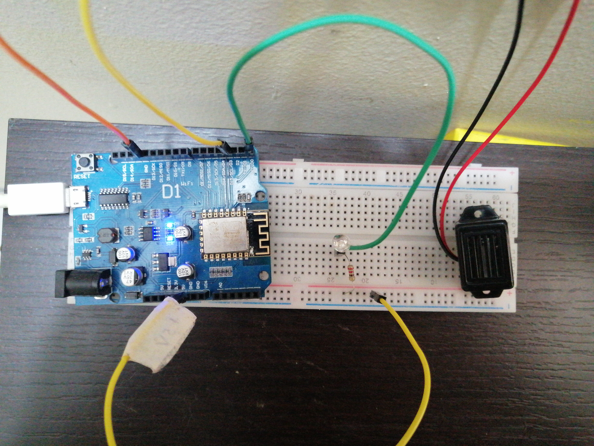
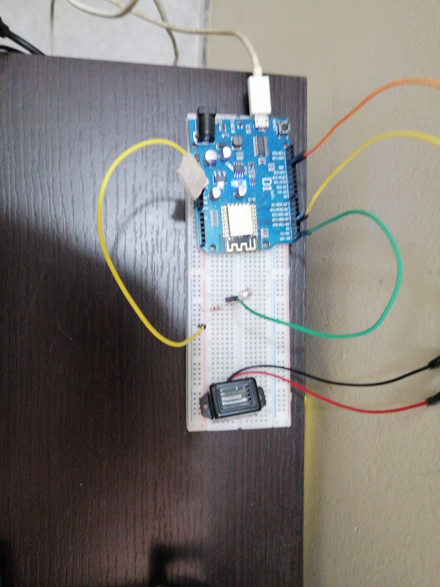
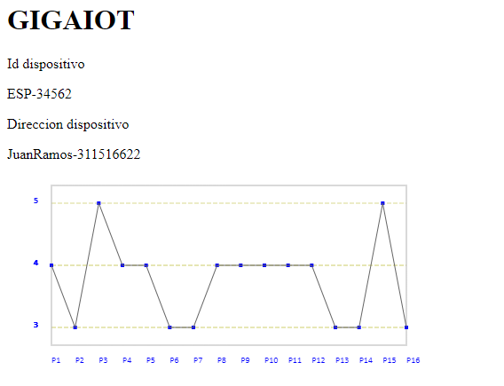

# GIGAIOT

Ingenieria de Software para IOT y BigData

### Integrantes

- Michael Jefferson Ballesteros Coca
- Juan Sebastian Ramos Isaza
- David Alejandro Vasquez Carreño

## Generalidades

Proyecto para ISIB

### Funcionalidades

Existe un dispositivo ESP-8266 que contien un script escrito en MicroPython, de manera que haga peticiones al servidor y para calcular el tiempo que tardo en llegar la peticion, de esta manera podemos determinar si hay una baja latencia en la red  y de esta manera notificar al usuario sobre el estado de la conexion​.

## Uso

Necesita un disposito ESP-8266 y su implementacion como se muestra en la imagen.

Cuando conecte el dispositivo a la energia y este conectado a internet, automaticamente le avisara al usuario cada cierto tiempo si hay una baja conexion.

## Reportes

La pagina permitira saber a que hora se hicieron las peticiones del dispositivos e indicar cuanto tiempo demoraron

La aplicacion desplegada en la nube podra generar graficas segun los tiempos determinados

## Construido con

* [Maven](https://maven.apache.org/) - Dependency Management
* [GIT](https://git-scm.com/) - Environment Version Control System
* [Java](https://www.java.com/es/) - General-purpose programming language
* [Docker](https://www.docker.com/) - OS-Level Virtualization
* [AWS](https://aws.amazon.com/es/) - Cloud Solutions
* [MicroPython](https://micropython.org/) - Programming Language
* [Mongo](https://www.mongodb.com/) - Document-Based distributed database built

## Licencia

Para más información de la licencia ver LICENSE

Para más proyectos, Sígueme y encuentra mis repositorios :D

## Agradecimientos

Juan Carlos Marino Dodge